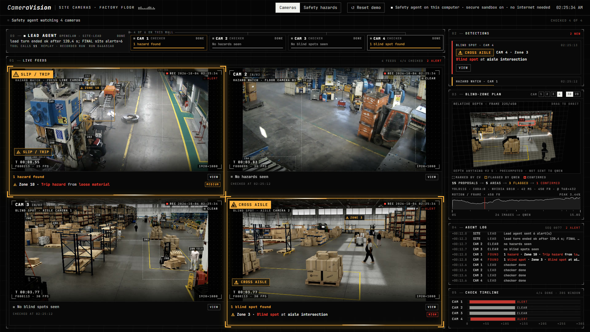

# NVIDIA x Dell Hackathon

HazardCam watches the cameras a factory or warehouse already has and flags safety hazards while there is still time to fix them. It runs on a single NVIDIA GB10 computer on site, so the video never leaves the building.

This is the camera wall (it calls itself CameraVision on screen) replaying four real checks from our GB10 runs. The lead agent runs along the top with one checker for each camera. Each feed marks the area its checker found, and the panel on the right turns the same camera into a 3D depth view with every candidate area drawn on it.

## Why it matters

A pallet left in a walkway or a blind corner where forklifts cross foot traffic can sit in view of a camera for hours before someone gets hurt. That footage usually gets watched only after the injury.

An injury then becomes expensive for the employer. Under its 2026 limits OSHA can fine up to $16,550 for each serious violation and $165,514 for each willful or repeat violation ([OSHA](https://www.osha.gov/memos/2026-05-21/2026-annual-adjustments-osha-civil-penalties)). The National Safety Council puts the total cost of work injuries in the United States at $181.4 billion for 2024 ([NSC Injury Facts](https://injuryfacts.nsc.org/work/costs/work-injury-costs/)). A hazard that gets cleared before anyone is hurt never turns into a citation or a claim.

Every alert is saved with the frames behind it and the model's written reason, which gives a site a dated record of what was checked and what was found.

## What happens during a check

Each camera goes through the same steps on the GB10 and nothing is sent to an outside service.

- **Find the candidates.** The pipeline builds a clean background for the fixed camera from 21 sampled frames and looks for anything that moves or sits out of place. A YOLO object detector and edge outlines mark the candidate areas so the model gets close-ups of the places that matter along with the full frame.
- **Review against safety rules.** Qwen 3.6 (a 35B model served by vLLM on the GB10) looks at sampled frames and close-ups of each area and compares them against a fixed set of OSHA General Industry rules. It has to answer in a strict format that names the zone, cites the evidence frames and says what to do. It only knows the camera by a neutral id.
- **Admit what the picture cannot show.** When a finding depends on something a camera cannot see, such as whether a press is powered or locked out, the model marks it for a person to verify instead of guessing.
- **Raise the alert.** The camera's checker agent decides which findings become alerts and may only choose from what the review reported. The lead agent gathers every camera and sends the site's alerts, which can also go to a phone through Telegram.

## The agents

The agents are built on OpenClaw and run inside NVIDIA's NemoClaw sandbox, where OpenShell controls what they can reach. One lead agent runs the site. It starts a checker for each camera and keeps checking on them until they finish, then sends the alerts. On the GB10 a single camera's check took between 62 and 116 seconds, and the lead agent's run across six cameras took 120 seconds. A new camera gets its own checker, and the rest of the system stays as it was.

## Limits

- **Visual screening only.** Findings are visual checks against OSHA references. They do not establish legal compliance and cannot see hidden controls or whether a worker was trained.
- **Minutes per camera.** A check takes one to two minutes on the GB10. That suits hazards that stay put such as blocked exits and material in walkways, and it is not a collision alarm.
- **Small test set so far.** HazardCam has been tested on ten short clips from factory and warehouse cameras. The next step is a pilot on a working site to measure how often it raises a false alarm over weeks of real footage.
